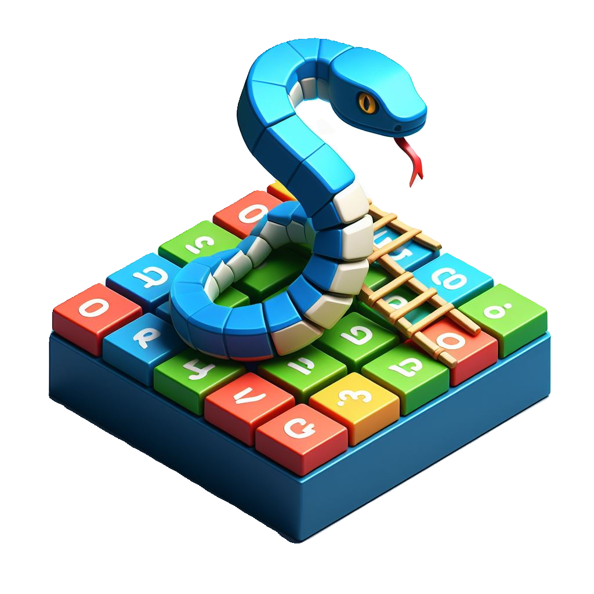
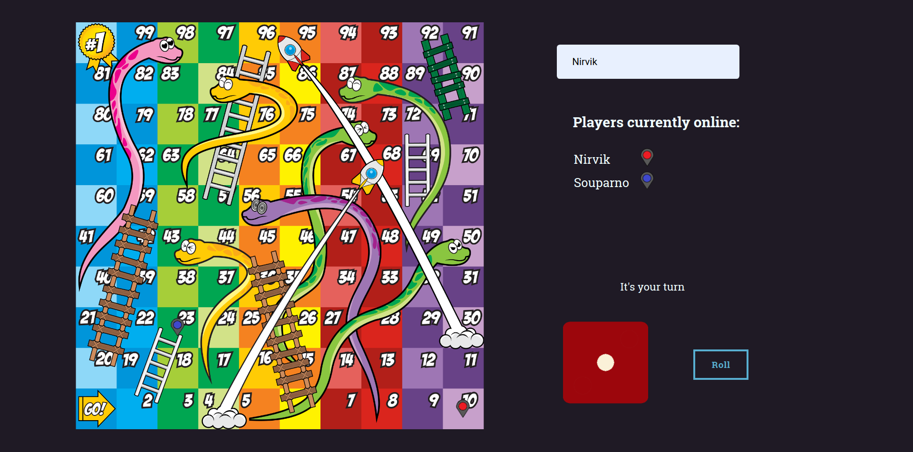

<a name="readme-top"></a>
<div align="center">
  
  <br/>

  <h3><b>Snakes and Ladders Remake</b></h3>

</div>

<!-- TABLE OF CONTENTS -->

# <b>Table of Contents 📋

- [📖 About the Project](#about-project)
  - [🛠 Built With](#built-with)
    - [Tech Stack](#tech-stack)
    - [Key Features](#key-features)
  - [🚀 Live Demo](#live-demo)
  - [🚀 Project Demo](#project-demo)
- [💻 Getting Started](#getting-started)
  - [Setup](#setup)
  - [Prerequisites](#prerequisites)
  - [Install](#install)
  - [Usage](#usage)
  - [Run tests](#run-tests)
  - [Deployment](#deployment)
- [👥 Authors](#authors)
- [👥 Attribution](#attribution)
- [🔭 Future Features](#future-features)
- [🤝 Contributing](#contributing)
- [⭐️ Show your support](#support)
- [🙏 Acknowledgements](#acknowledgements)
- [❓ FAQ (OPTIONAL)](#faq)
- [📝 License](#license)
</b>
<hr><hr>
<!-- PROJECT DESCRIPTION -->

# <b>Snakes and Ladders Remake  📖</b><a name="about-project"></a>
This project is a real-time multiplayer game built using Express, and Socket.IO. It allows multiple players to join a game session and play simultaneously in a shared virtual environment. The game is based on the classic board game, Snakes and Ladders, where players take turns to roll a dice and move their pieces across the board. The game is won by the first player to reach the last square on the board.
The project inspired by https://github.com/Soupaul/snakes-and-ladders-multiplayer
<br><hr>

<!-- BUILT WITH -->
## <b>Built With 🛠</b><a name="built-with"></a><br>

<!-- TECH STACK -->
### <b>Tech Stack 🗜️</b><a name="tech-stack"></a>

<details>
  <summary>Client</summary>
  <ul>
    <li><a href="https://developer.mozilla.org/en-US/docs/Web/HTML">HTML5</a> markup to build raw structure of this web page</li><br>
    <li><a href="https://developer.mozilla.org/en-US/docs/Web/CSS">CSS3</a> custom properties, <a href="https://css-tricks.com/snippets/css/a-guide-to-flexbox/">FlexBox</a>, <a href="">Grid</a> to make the website visually attractive</li><br>
    <li><a href="https://reactjs.org/">Javascript</a></li><br>
    <li><a href="https://mozilla.github.io/addons-linter/">Linters</a> for coding convention and coding formating</li>
  </ul>
</details>

<details>
  <summary>Javascript runtime environment</summary>
  <ul>
    <li><a href="">Node JS</a> as a javascript runtime machine [git], a free and open source distributed version control system</li>
  </ul>
</details>

<details>
  <summary>Deployment</summary>
  <ul>
    <li><a href="#deployment">Netlify</a></li>
  </ul>
</details>

<details>
  <summary>Bundler</summary>
  <ul>
    <li><a href="https://webpack.js.org/">Webpack</a></li>
  </ul>
</details>

<details>
  <summary>Version Control</summary>
  <ul>
    <li><a href="https://datasift.github.io/gitflow/IntroducingGitFlow.html">Gitflow</a></li>
  </ul>
</details>

<details>
  <summary>Socket IO Control</summary>
  <ul>
    <li><a href="https://socket.io/">SocketIO </a></li>
  </ul>
</details>

<details>
  <summary>CryptoJS</summary>
  <ul>
    <li><a href="https://www.npmjs.com/package/crypto-js">CryptoJS </a></li>
  </ul>
</details>
<details>
  <summary>Nodemon</summary>
  <ul>
    <li><a href="https://www.npmjs.com/package/nodemon">Nodemon </a></li>
  </ul>
</details>

<br><hr>

<!-- KEY FEATURES -->
### <b>Key Features 🏷️</b> <a name="key-features"></a>

- **Snakes a ladders board**
- **Display player positions**
- **Display players**
- **Display score board**
- **If a player wind display winner**

<p align="right">(<a href="#readme-top">back to top</a>)</p>
<br><hr>

<!-- LIVE DEMO -->
## <b>Live Demo 🚀</b><a name="live-demo"></a>


No Live demo available

<p align="right">(<a href="#readme-top">back to top</a>)</p>
<hr>

<!-- PROJECT DEMO -->
## <b>Project Demo 🏁</b><a name="project-demo"></a>

No project demo available

<p align="right">(<a href="#readme-top">back to top</a>)</p>
<hr>

<!-- GET STARTED -->
## <b>Getting Started 💻</b><a name="getting-started"></a>

To get a local copy up and running, follow these steps.

<!-- PREREQUISITIES -->
### <b>Prerequisites 🧱</b><a name="prerequisites"></a>

In order to run this project you need:

- A Github account
- Node JS
- A web browser to view output e.g [Chrome](https://www.google.com/chrome/).
- An IDE e.g [Visual studio code](https://code.visualstudio.com/).
- [A terminal](https://code.visualstudio.com/docs/terminal/basics).

<br><hr>

<!-- SETUP -->
### <b>Setup ⚙️</b><a name="setup"></a>

Clone this repository to your desired folder:<br>
```sh
cd my-folder
git clone https://github.com/RileyManda/snakes-ladders

  ```
  - Navigate to the folder
```
cd my-folder
```
- Checkout the branch
```
git checkout dev
```
<br><hr>

<!-- INSTALL -->
### <b>Install 🏗️</b><a name="install"></a>

Install all dependencies:

```sh
    yarn
```
<br><hr>

<!-- USAGE -->
### <b>Usage 📂</b><a name="usage"></a>

To run the project, follow these instructions:

```
yarn start
```

<!-- TESTS -->
<br><hr>
### <b>Run tests 🧪</b><a name="run-tests"></a>

How should it be tested?
To run tests, run the following command:

- HTML linter errors run:

```
npx hint . --fix
```

- CSS linter errors run:

```
npx stylelint "**/*.{css,scss}" --fix
```

- JavaScript linter errors run:

```
npx eslint . --fix
```

- For unit testing, run:

```
npm test
```
<br><hr>

<!-- DEPLOYEMENT -->
### <b>Deployment</b> <a name="deployment"></a>

<!-- You can deploy this project using: GitHub Pages, [Vercel](https://vercel.com/) or [Netlify](https://www.netlify.com/). -->

This project was deployed using GitHub Pages. For more information about how to use GitHub pages [read here](https://www.w3schools.com/git/git_remote_pages.asp?remote=github) 🤩.

If you want to watch a video about how to use GitHub pages instead of reading [click here](https://www.youtube.com/watch?v=QyFcl_Fba-k&t=251s) ☺️.


<p align="right">(<a href="#readme-top">back to top</a>)</p>

<br><hr>

<!-- AUTHORS -->
## 👥 Authors <a name="authors"></a>

👤 **Riley Manda**

- GitHub: [@RileyManda](https://github.com/RileyManda)
- Twitter: [@rilecodez](https://twitter.com/rilecodez)
- LinkedIn: [rileymanda](https://www.linkedin.com/in/rileymanda/)

<p align="right">(<a href="#readme-top">back to top</a>)</p>

<br><hr>

<!-- FUTURE FEATURES -->
## <b>Future Features 🔭</b><a name="future-features"></a>

- [ ] **Improve the UI with animations**
- [ ] **Project UI Styling**


<p align="right">(<a href="#readme-top">back to top</a>)</p>

<br><hr>

<!-- ATTRIBUTION -->
## 👥 Attribution <a name="attribution"></a>

Project Inspired by Soupaul :
- GitHub: [@Soupaul](https://github.com/Soupaul/snakes-and-ladders-multiplayer)
- ProjectIcon: [Svgrepo](https://www.svgrepo.com/)

- Board from [VectorStock / vable](https://www.vectorstock.com/royalty-free-vector/snake-and-ladder-and-rocket-game-vector-8154064%22)
- Player pin images from [Khurshid Alam Bhuyan](https://opengameart.org/users/khurs10101)



<!-- CONTRIBUTING -->

## <b>Contributing 🤝</b><a name="contributing"></a>

If you have suggestions 📝, ideas 🤔, or bug reports 🐛, please feel free to open an [issue](https://github.com/RileyManda/SciMovies/issues) on GitHub.
Remember, every contribution, no matter how big or small, makes a difference.

<p align="right">(<a href="#readme-top">back to top</a>)</p>

<br><hr>


<!-- SUPPORT -->
## <b>Show your support 🌟</b><a name="support"></a>

Thank you for taking the time to explore this project! Your support means a lot to me. If you find my project valuable and would like to contribute, here is one way you can support me:

 - <b>Star the project ⭐️</b>: Show your appreciation by starring this GitHub repository. It helps increase visibility and lets others know that the project is well-received.

 - <b>Fork the project 🍴 🎣</b>: If you're interested in making improvements or adding new features, feel free to fork the project. You can work on your own version and even submit pull requests to suggest changes.

 - <b>Share with others 🗺️</b>: Spread the word about this project. Share it on social media, mention it in relevant forums or communities, or recommend it to colleagues and friends who might find it useful.

<p align="right">(<a href="#readme-top">back to top</a>)</p>

<br><hr>

<!-- ACKNOWLEDGEMENTS -->
## <b>Acknowledgments 🙏</b><a name="acknowledgements"></a>

I would like to express my sincere gratitude to [CodeForte](https://www.codeforte.com/) for the opportunity to build build this project.
<p align="right">(<a href="#readme-top">back to top</a>)</p>

<br><hr>

<!-- FAQ (optional) -->
## <b>FAQ ❓</b><a name="faq"></a>

- **Question_1**
  Do I have to use the vs code specifically?
  - Answer_1
    You can use any code editor of your choice. <br>
- **Question_2**
  Where can I download node JS for installation?
  - Answer_2
  Node.js® is a JavaScript runtime built on Chrome's V8 JavaScript engine.
  It can be downloaded here: https://nodejs.org/en/download/Node.jsNode.js

<p align="right">(<a href="#readme-top">back to top</a>)</p>

<!-- LICENCE -->
## <b>License 📝</b><a name="license"></a>

This project is [MIT](./LICENSE) licensed.

<p align="right">(<a href="#readme-top">back to top</a>)</p>

